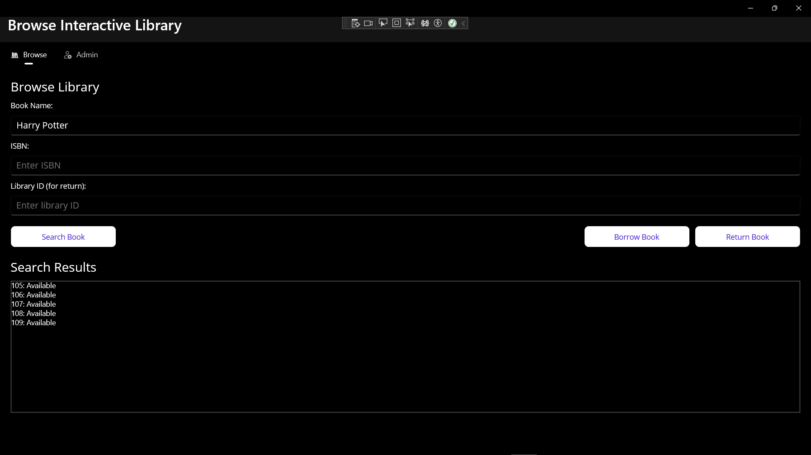
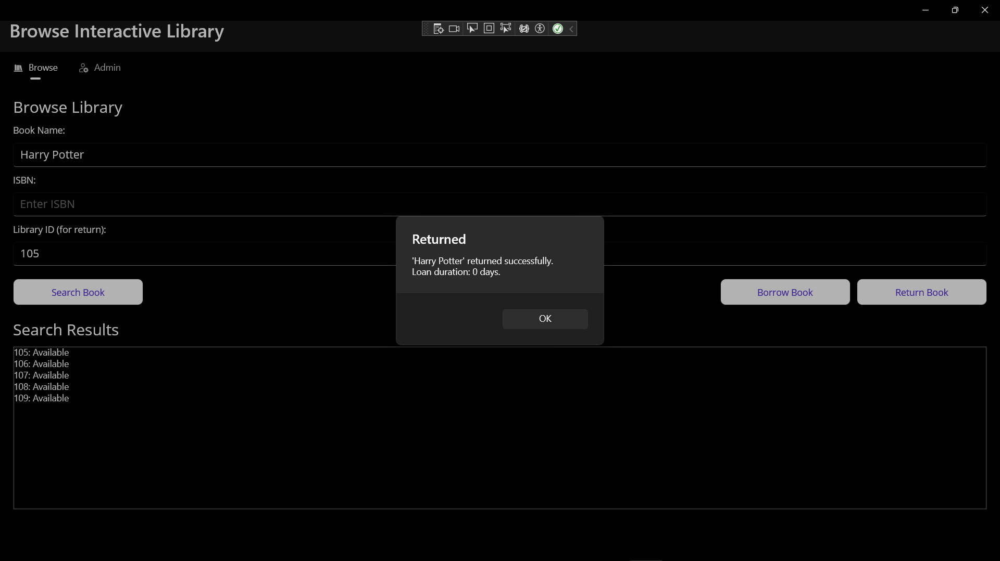
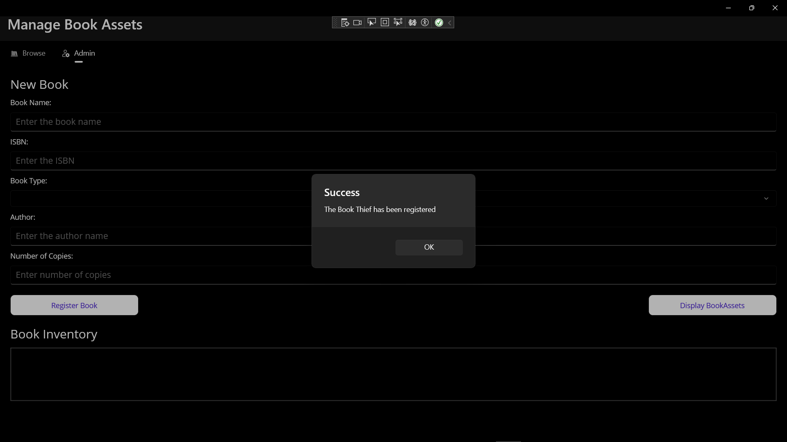
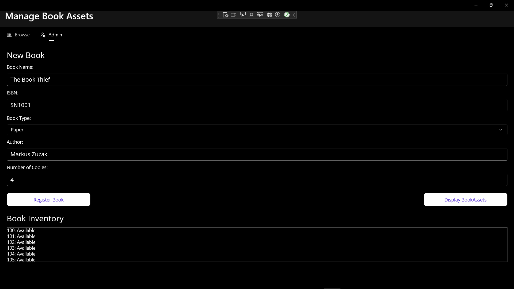

# Library Management Application
### PROG 10065 – Interactive Application Development
**Author:** Jagrit  
**Date:** April 2026

---

## Purpose
A GUI-based Library Management application built with C# and .NET MAUI. The app allows library clients to search, borrow, and return books, and allows administrators to register new books and their assets into the library inventory.

---

## Part II – Inputs and Outputs

### Table of Inputs

| Name | Type | MAUI Control |
|------|------|--------------|
| Book name (search) | string | Entry |
| Book ISBN (search) | string | Entry |
| Library ID (return) | int | Entry |
| Book name (register) | string | Entry |
| Book ISBN (register) | string | Entry |
| Author name | string | Entry |
| Book type | BookType (enum) | Picker |
| Number of copies | int | Entry |

### Table of Outputs

| Name | Type | MAUI Control |
|------|------|--------------|
| List of book assets | List\<string\> | CollectionView |
| Borrow confirmation | string | DisplayAlert |
| Return confirmation + late fees | string | DisplayAlert |
| Book availability status | string | DisplayAlert |
| Registered book inventory | List\<LibraryAsset\> | CollectionView |

---

## Part III – Screenshots

### Browse Page – Search
  
The client enters a book name or ISBN and clicks Search. The matching book's assets are displayed in the list below showing each asset ID and availability status.

### Browse Page – Borrow
  
After selecting a book the client clicks Borrow. The app confirms the loan, shows the due date, and displays the library ID to use when returning.

### Browse Page – Return
  
The client enters the library ID and clicks Return. The app confirms the return, shows the loan duration, and displays any applicable late fees.

### Admin Page – Register Book
  
The administrator enters book details, selects the book type, and specifies the number of copies. Clicking Register Book adds the book and its assets to the library inventory.

### Admin Page – Display Assets
  
The administrator clicks Display Assets to view all current assets across all books in the library inventory.

---

## Key Design Decisions

**Dependency Injection** — A single `Library` instance is registered as a singleton in `MauiProgram.cs` and shared across both pages via constructor injection. This ensures books registered in the admin page are immediately visible in the browse page.

**Polymorphism** — `BorrowBook()` and `ReturnBook()` are declared as `virtual` in the `Book` base class and overridden in `PaperBook` and `DigitalBook` to apply type-specific loan durations and late fee calculations.

**Separation of Concerns** — Business logic lives entirely in the `BusinessLogic` class library. Pages only handle user interaction and delegate all operations to the `Library`, `Book`, and `LibraryAsset` classes.

---
